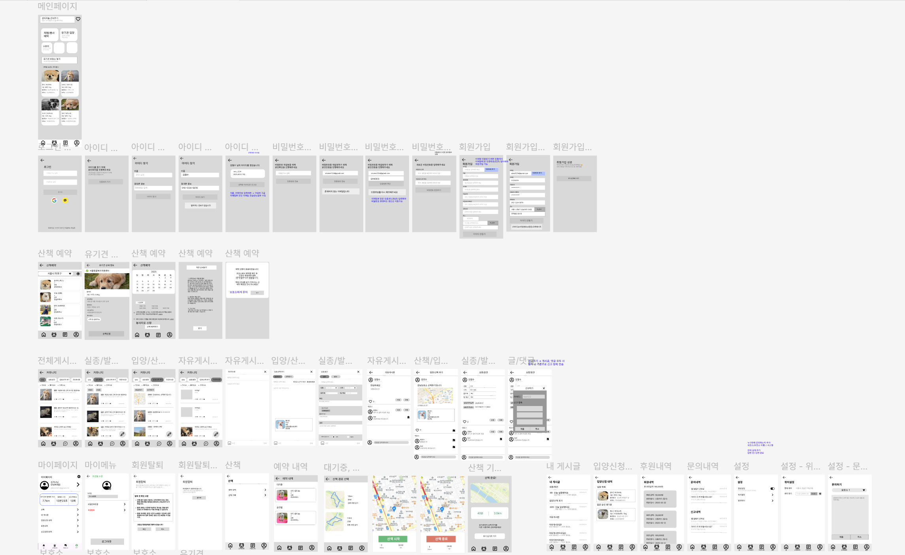

# 🐾 여기보개 (HereDoggy)

> 유기동물 보호소와 시민을 연결하여 입양 전 교감 기회를 제공하는 **유기동물 체험 플랫폼**

---

# 📆 프로젝트 진행 기간
2025.05.09 ~ (진행중) (현 9주차)

---

# 🧑‍💻 팀원 소개

|   [이정은(팀장)](https://github.com/lejeongeun)   |                                                      [양제훈](https://github.com/Ssassin-01)                                                       |      [유예성](https://github.com/tytgame)       |     [조규훈](https://github.com/JoKyuHoon)      |
|:--------------------------------------------:|:-----------------------------------------------------------------------------------------------------------------------------------------------:|:--------------------------------------------:|:--------------------------------------------:|
|  |                                                                                                     |  |  |
|                   Backend                    |                                                                     Backend                                                                     |                 웹/앱 Frontend                 |                  웹 Frontend                  | 
|    - 산책 및 체험 API - 입양 API - 결제 API     | - JWT 설정(Access/RefreshToken)  - 게시판(자유, 실종/제보,  산책/입양 리뷰, 공지사항) API -신고 및 문의 API -실시간 알림 API(FCM, SSE)  -봉사 로직 API  -챗봇 API  |                        웹/앱 Frontend          |                  웹 Frontend                  |

## 🔍 팀원 역할

- **이정은**: 산책 및 체험 API, 입양 API, 결제 API
- **양제훈**: 게시판(자유, 실종/제보, 산책/입양 리뷰, 공지사항) API, 신고 및 문의 API, 실시간 알림 API(FCM, SSE), 챗봇 API
- **유예성**:
- **조규훈**:

---

## 📖 목차 

1. [프로젝트 기획 배경](#1-프로젝트-기획-배경)
2. [프로젝트 목표](#2-프로젝트-목표)
3. [주요 기능](#3-주요-기능)
4. [서비스 화면](#4-서비스-화면)
5. [개발 환경](#5-개발-환경)
6. [프로젝트 구조](#6-프로젝트-구조)
7. [피그마 (와이어프레임)](#7-피그마-와이어프레임)
8. [요구사항 정의서](#8-요구사항-정의서)
9. [API 명세서](#9-api-명세서)
10. [ERD](#10-erd)
11. [아키텍처](#11-아키텍처)
12. [팀원 소개](#12-팀원-소개)
    - [팀원 역할](#12-1-팀원-역할)
13. [프로젝트 회고](#13-프로젝트-회고)

---

## 1. 📌 프로젝트 기획 배경

유기동물 입양 전, 시민들이 직접 유기동물과 교감할 기회가 부족합니다.  
**여기보개**는 보호소와 시민을 연결하는 **참여형 체험 플랫폼**을 제안합니다.  
이를 통해 **입양률을 높이고, 보호소의 부담을 줄이며**, **지역사회와 생명 존중 문화**를 동시에 살립니다.

---

## 2. 🎯 프로젝트 목표

- **입양 전 체험 기회를 제공하여 유기동물의 새로운 가족을 찾을 수 있도록 도와줍니다.**
- **시민 참여 기반의 봉사 및 제보 활동을 통해 지역사회 문제 해결에 기여합니다.**
- **디지털화된 보호소 운영 시스템으로 유기동물 관리의 효율성을 높입니다.**
- **지방 지자체의 협력을 통해 지속 가능한 운영 구조를 만듭니다.**
- **굿즈/산책 용품을 판매해 수익구조를 마련합니다.**

---

## 3. 🚀 주요 기능 

### 👤 사용자

#### 🐾 산책/체험 및 입양
- **유기동물 산책/체험 예약**
- **산책 시 실시간 산책 경로 조회 가능**
- **입양 신청 및 설문 응답**

#### 📍 제보 및 커뮤니티
- **위치 기반 유기견 제보 등록 및 알림 처리**
- **자유 게시판 / 산책·입양 후기 게시판 / 실종·목격 게시판**
- **댓글, 좋아요, 신고 기능**

#### 🙋‍♀️ 봉사 및 참여

- **산책 봉사자 등록 신청**  
  보호소에 봉사자로 등록 요청 → 승인 시 활동 가능  
  → 체험 내역 자동 누적 / 인증서 발급

- **굿즈 및 체험 키트 이용**  
  산책 참여 후 굿즈 구매, 대여 키트 활용 가능

#### 🔔 알림
- **실시간 푸시 알림 (FCM / SSE)**
- 알림 읽음 처리

#### 🤖 AI 기능
- **자동품종 등록**
- **AI 기반 맞춤 추천 (MBTI/유사동물 추천)**
- **Gemini 기반 챗봇 Q&A (입양, 사후관리 등)**  

---

### 🏢 보호소 관리자

#### 🐶 보호 동물 관리

- **유기동물 관리**

#### 📆 예약 및 일정 관리

- **산책/체험 예약 승인 및 거절**
- **월별 예약 캘린더 관리**

#### 🗺 제보 및 커뮤니티

- **지도 기반 제보 확인 및 상태 처리**
- **공지사항 및 보호소 커뮤니티 운영**

---

### 🛠 시스템 관리자

#### 🏢 계정 및 보호소 권한 관리

- **보호소 등록 요청 승인/거절**
- **사용자 / 관리자 계정 및 권한 관리**

#### 🚨 시스템 모니터링

- **신고 및 문의 처리 (게시글, 댓글, 사용자 등)**
- **대시보드 통계 제공**  
  산책률 / 입양률 / 제보 처리 현황 등

---

## 4. 🖼️ 서비스 화면
### 1. 홈 화면

### 2. 산책화면 + 산책 기록 화면

### 3. 입양화면

### 4. 커뮤니티

### 5. 제보하기

### 6. 문의하기

### 7. 신고하기

### 8. 봉사화면

### 9. 봉사화면

### 10. 굿즈

### 11. 챗봇

### 12. 보호소 관리자 페이지쪽

### 13. 관리자 페이지쪽

### 14. 지자체 연계

---

## 5. ⚙️ 개발 환경

### Frontend  
 

   

### Backend

### DataBase

### Infra/DevOps  

### 협업 문서화

  

### API

📦 상세 기술스택 및 버전 보기

 

### 🖥️ Frontend (Web)

| 기술스택       | 설명               | 버전 |
|----------------|------------------|------|
| React          | 웹 프론트엔드 프레임워크    | 19.1.0 |
| JavaScript  | 자바스크립트           | ES2020    |
| React Router DOM | 라우팅 라이브러리        | 7.6.1 |
| Axios          | HTTP 클라이언트 라이브러리 | 1.9.0 |
| Recharts       | 데이터 시각화 차트       | 2.15.3 |
| React Toastify | 토스트 메시지 라이브러리    | 11.0.5 |
| Swiper         | 슬라이더 라이브러리       | 11.0.7 |
| React Datepicker | 날짜 선택 라이브러리      | 8.4.0 |

### 📱 Frontend (App)

| 기술스택 | 설명                     | 버전   |
|----------|--------------------------|--------|
| Flutter  | 크로스 플랫폼 앱 프레임워크 | 3.7.2 |
| Dart     | Flutter 프로그래밍 언어     | 3.7.2 |
| Firebase | 앱 기능 연동 및 인증       | 3.6.0 |
| Dio      | HTTP 클라이언트           | 5.4.0 |
| Provider | 상태 관리 라이브러리       | 6.1.0 |
| HTTP     | 기본 HTTP 라이브러리       | 1.1.0 |

### 🔧 Backend

| 기술스택        | 설명                          | 버전      |
|-----------------|-------------------------------|---------|
| Java OpenJDK    | 백엔드 언어                   | 17      |
| Spring Boot     | 백엔드 프레임워크             | 3.4.5   |
| Spring Data JPA | ORM 프레임워크                | 3.4.5   |
| Spring Security | 인증 및 인가 처리             | 6.4.5   |
| JWT             | Access / Refresh 토큰 인증    | -       |
| Lombok          | Java 코드 어노테이션 자동화    | 1.18.38 |
| Gradle          | 빌드 도구                     | 8.13    |

### 🗄️ Database

| 기술스택   | 설명                      | 버전     |
|------------|---------------------------|--------|
| PostgreSQL | 관계형 데이터베이스        | 17.2   |
| Redis      | 인메모리 데이터 저장소     | 3.0.504 |

### ☁️ Infra / DevOps

| 기술스택 | 설명                          |
|----------|-------------------------------|
| AWS EC2  | 서버 인스턴스 운영             |
| AWS S3   | 이미지/정적 파일 저장소        | 
| Nginx    | 리버스 프록시 및 정적 파일 서빙 | 

### 🤝 협업 / 문서화

| 도구      | 설명                    |
|-----------|-------------------------|
| Git       | 버전 관리               |
| GitHub    | 리포지토리 및 이슈 관리 |
| Notion    | 회의 및 문서 협업 도구  |
| Postman   | API 테스트 도구         |
| Figma     | UI 설계 도구            |
| Discord   | 실시간 커뮤니케이션     |

### 🔐 API / 인증

| 기술스택            | 설명                                |
|---------------------|-------------------------------------|
| OAuth2              | Google / Kakao 소셜 로그인          |
| JavaMailSender      | 이메일 인증 및 비밀번호 재설정      |
| JWT                 | Access / Refresh 토큰 기반 인증    |
| Firebase Cloud Messaging (FCM) | 앱 푸시 알림                |
| SSE (Server-Sent Events)       | 실시간 웹 알림              |
| Naver/Google Map API           | 지도 및 위치 서비스         |
| Gemini (Flash)      | 이미지 분석 및 AI 연동 (예정)       |

---

## 6. 📁 프로젝트 구조

---

## 7. 📝 피그마 (와이어프레임)

[🔗 Figma Link](https://www.figma.com/design/WFEyxs4K7yCmOrOnrZS5pQ/%EC%97%AC%EA%B8%B0%EB%B3%B4%EA%B0%9C?node-id=0-1&p=f&t=Ghqz4yIUcM6AZOi2-0)

### 📄 사용자 와이어프레임:

 

### 📄 보호소관리자 와이어프레임:

---

## 8. 📋 요구사항 정의서

- 산책은 보호소 승인 후 확정됨
- 제보는 위치 기반으로 등록 및 처리
- 입양은 산책 또는 후기 후에만 신청 가능
- 알림은 SSE 또는 FCM으로 실시간 전달

---

## 9. 📡 API 명세서

### 📄 사용자 API
[🔗 notion Link](https://www.notion.so/API-1f12b8afefe5813a9e65f705f7dff230?source=copy_link)

### 📄 관리자 API
[🔗 notion Link](https://www.notion.so/API-1f12b8afefe5813a9e65f705f7dff230?source=copy_link)

---

## 10. 🧬 ERD

---

## 11. 🏗️ 아키텍처

---

## 13. 💬 프로젝트 회고

> 각 팀원이 작성한 회고 정리

- **이정은**: 실시간 SSE는 어렵지만 도전할 가치가 있었습니다.
- **양제훈**: 사용자 UX를 고려한 Flutter 구조를 고민하며 성장했습니다.
- **유예성**: 운영자 시나리오 중심의 화면 설계가 인상 깊었습니다.
- **조규훈**: AI 기술이 실제 사회 문제 해결에 기여할 수 있어 뜻깊었습니다.

---
